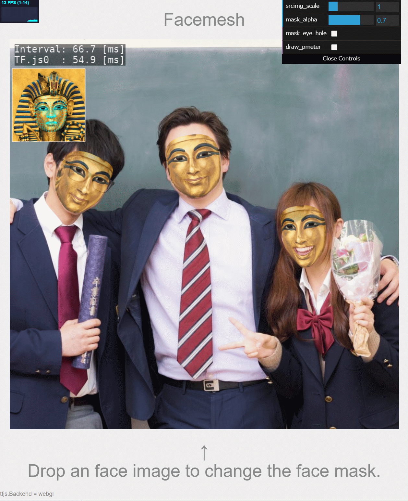

# tfjs_webgl_app
WebGL visualization apps using TensorFlow.js

## Handpose
Live demo is [here](https://terryky.github.io/tfjs_webgl_app/handpose). 

## 3D Pose estimation
Live demo is [here](https://terryky.github.io/tfjs_webgl_app/pose_estimation_3d). 

## Facemesh (replace faces)
Live demo is [here](https://terryky.github.io/tfjs_webgl_app/facemesh). 

## Blazepose (upper_body)
Live demo is [here](https://terryky.github.io/tfjs_webgl_app/blazepose). 

## Blazepose (full_body)
Live demo is [here](https://terryky.github.io/tfjs_webgl_app/blazepose_fullbody). 

## Face Segmentation (BiseNetv2)
Live demo is [here](https://terryky.github.io/tfjs_webgl_app/face_segmentation). 

## Classification
Live demo is [here](https://terryky.github.io/tfjs_webgl_app/classification). 

# Acknowledgements
- https://github.com/tensorflow/tfjs-models
- https://github.com/google/mediapipe
- https://github.com/openvinotoolkit/open_model_zoo/tree/master/demos/python_demos/human_pose_estimation_3d_demo
- https://github.com/MaybeShewill-CV/bisenetv2-tensorflow
- https://github.com/PINTO0309/PINTO_model_zoo
